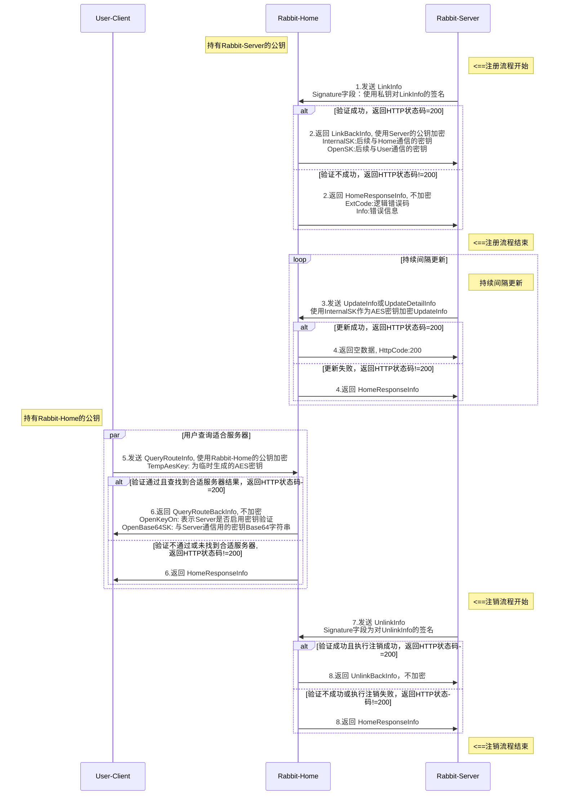

# Rabbit-Home

[English](./README_EN.md) | 简体中文

## 1. 简介
Rabbit-Home 是一个用于管理和监控服务器实例的项目。它支持通过命令行和HTTP请求来管理服务器实例，包括连接、断开连接、更新状态、查询信息和踢除实例等功能。

## 2. 项目结构

```yaml
core/               // Rabbit-Home 项目的核心部分，包含了客户端、命令行、配置管理和服务器相关的逻辑。
├── client/         // 包含了客户端相关的逻辑，用于连接、断开连接和更新服务器实例的状态。
├── cmd/            // 包含了命令行相关的逻辑，用于通过命令行管理服务器实例。
├── conf/           // 包含了配置相关的逻辑，用于解析和管理配置文件中的参数。
├── home/           // 包含了服务器相关的逻辑，用于启动服务器、处理 HTTP 请求和管理服务器实例。
└── core.go         // core包开放接口与结构体定义
res/
└── keys/           // main 与 main_test 运行时使用到的密钥文件
└── keys_example/   // 预生成的密钥文件与说明文档
└── config.yaml     // 配置文件，用于配置服务器的监听地址、内部和外部IP控制、超时参数和日志记录参数。
src/
├── main.go         // 项目的入口文件，启动服务器并开始命令行监听。
└── main_test.go    // 测试用例，用于测试连接功能。
LICENSE             // 授权协议文件
README.md           // 中文项目介绍说明文件
README_EN.md        // 英文项目介绍说明文件
REMARK.md        // 备忘录文档
```

- **core**: 核心包，包含了客户端、命令行、配置管理和服务器相关的逻辑。
  + **client**: 客户端相关的逻辑，如连接、断开连接和更新状态等。
  + **cmd**: 命令行相关的逻辑，如列表、信息查询和踢除实例等。
  + **conf**: 配置相关的逻辑，如IP验证器和配置解析等。
  + **home**: 服务器相关的逻辑，如服务器启动、处理请求和管理实体等。
  + **core.go**: core包开放接口与结构体定义
- **res**: 包含了配置文件，用于配置服务器的监听地址、内部和外部IP控制、超时参数和日志记录参数。
  + **config.yaml**: 配置文件，用于配置服务器的监听地址、内部和外部IP控制、超时参数和日志记录参数。
- **src**: 包含了项目的入口文件，启动服务器并开始命令行监听。
  + **main.go**: 项目的入口文件，启动服务器并开始命令行监听。
  + **main_test.go**: 测试用例，用于测试连接功能。

## 3. 安装和运行
通过 `go mod` 或 克隆整个仓库到 `gopath` 中便在项目中使用 Rabbit-Home.

### 安装
支持使用go.mod或gopath管理仓库

- 通过gopath加载仓库
``` bash
go get -u github.com/xuzhuoxi/Rabbit-Home
```

- 通过go.mod加载仓库
  克隆项目到本地并安装依赖
``` bash
git clone github.com/xuzhuoxi/Rabbit-Home 
cd Rabbit-Home
go mod tidy
```

### 运行项目
``` bash
go run src/main.go
```

## 4. 概要说明

### 功能
- Rabbit-Server 向 Rabbit-Home 注册自己信息。
- Rabbit-Server 向 Rabbit-Home 更新自己信息状态。
- Rabbit-Server 向 Rabbit-Home 注销自己。
- 客户端 向 Rabbit-Home 查询适合的 Rabbit-Server 服务器实例信息。
- 以上功能均支持开启密钥验证。

### 功能图示


## 5. 配置
配置文件 `res/config.yaml` 用于配置服务器的监听地址、内部和外部IP控制、超时参数和日志记录参数。

### HTTP 服务配置
```yaml
http:
  addr: "127.0.0.1:9000"
```
- addr: 服务器的监听地址和端口。
  + 值: 127.0.0.1:9000
  + 说明: 服务器将在本地地址 127.0.0.1 的端口 9000 上监听 HTTP 请求

### 内部Rabbit-Server实例 服务配置
```yaml
internal:
  ##### 内部Rabbit-Server实例 Http请求方式
  post: false
  ##### 内部Rabbit-Server实例 超时设置
  timeout: 300000000000 # 5分钟, 单位:纳秒
  ##### 内部Rabbit-Server实例 Ip访问控制配置
  ip-verify:
    allows-on: false
    allows:
    blocks-on: false
    blocks:
      - "192.168.0.1"
      - "10.0.0.1-20"
      - "2001:0db8:85a3:0000:0000:8a2e:0370:7334"
      - "2001:db8:85a3::8a2e:370:7334"
      - "2001:0db8:85a3:0000:0000:8a2e:0370:0-7334"
      - "2001:0db8:85a3:0000:0000:8a2e:0370:0-7334"
  #### 内部Rabbit-Server实例 密钥校验配置
  key-verify:
    enable: true # 是否开启密钥校验
    share: '00000000000000000000000000000000' # 共享密钥
    key-type: "pem" # 密钥类型：pem,rsa,ssh
    keys-path: "keys/public" # 公钥文件目录
    hot-keys-enable: true # 是否开启密钥的热部署
    hot-keys-path: "keys/hot" # 热部署的公钥文件路径
```
- **post**
  - 值: true|false
  - 说明: 是否要求使用POST请求。
- **timeout**: 实例的超时时间。
  + 值: 纳秒数（即 5 分钟）
  + 说明: 如果实例在 timeout时间内没有向服务器发送信息更新，则认为该实例已断开连接。
- ip-verify
  + **allows-on**: 是否启用内部 IP 白名单。
    - 值: false|true
    - 说明: 为 true 时， allows 配置生效。
  + **allows**: 内部 IP 白名单列表。
    - 值: 数组，内容为ip地址或i地址范围(仅支持最后一组使用'-'表示范围)，不包含接口
    - 说明: 当 allows-on 为 false，白名单列表中的 IP 地址不会生效。
  + **blocks-on**: 是否启用内部 IP 黑名单。
    - 值: false|true
    - 说明: 为 true 时， blocks 配置生效。
  + **blocks**: 内部 IP 黑名单列表。
    - 值: 数组，内容为ip地址或i地址范围(仅支持最后一组使用'-'表示范围)，不包含接口
    - 说明: 当 blocks-on 为 false，黑名单列表中的 IP 地址不会生效
  + **注意：**
    - 优先级：黑名单 > 白名单
- key-verify:
  + **enable**: 是否开启密钥校验
    - 值: true|false
    - 说明: 是否开启密钥校验
  + **share**: 
    - 值: 字符串
    - 说明：共享密钥字符串, 用于派生临时密钥，不应该少于6个字符
  + **key-type**: 密钥类型规范
    - 值: "pem"|"rsa"|"ssh"
    - 说明：
      + pem: 公钥为x.509规范，私钥为PKCS#8规范。
      + rsa: 公钥为RSA规范，私钥为PKCS#1规范。
      + ssh: 公钥为OpenSSH规范，私钥为PKCS#1规范。
  + **keys-path** 
    - 值: 字符串
    - 说明：公钥文件目录, 相对于运行目录的相对路径
  + **hot-keys-enable**
    - 值: true/false
    - 说明：是否开启密钥的热部署支持
  + **hot-keys-path**
    - 值: 字符串
    - 说明：热部署的公钥文件目录路径, 相对于运行目录的相对路径

### 外网客户端 服务配置
```yaml
external:
  ##### 外部客户端 Http请求方式
  post: false
  ##### 外部客户端 Ip访问控制配置
  ip-verify:
    allows-on: false
    allows: []
    blocks-on: false
    blocks:
      - "8.8.8.8"
  key-verify:
    enable: true # 是否开启密钥校验
    key-type: "pem" # 密钥类型：pem,rsa,ssh
    key-path: "keys/private/pkcs8_private.pem" # 私钥文件路径
```
- **post**: 是否要求使用POST请求。
- **ip-verify**
  + **allows-on**: 是否启用外部 IP 白名单。
    - 值: false|true
    - 说明: 为 true 时， allows 配置生效。
  + **allows**: 外部 IP 白名单列表。
    - 值: 数组，内容为ip地址或i地址范围(仅支持最后一组使用'-'表示范围)，不包含接口
    - 说明: 当 allows-on 为 false，白名单列表中的 IP 地址不会生效。
  + **blocks-on**: 是否启用外部 IP 黑名单。
    - 值: false|true
    - 说明: 为 true 时， blocks 配置生效。
  + **blocks**: 内部 IP 黑名单列表。
    - 值: 数组，内容为ip地址或i地址范围(仅支持最后一组使用'-'表示范围)，不包含接口
    - 说明: 当 blocks-on 为 false，黑名单列表中的 IP 地址不会生效
  + **注意：**
    - 优先级：黑名单 > 白名单
- key-verify:
  + **enable**
    - 值: true|false
    - 说明：是否开启密钥校验
  + **key-type**: 密钥类型规范
    - 值: "pem"|"rsa"|"ssh"
    - 说明：
      + pem: 公钥为x.509规范，私钥为PKCS#8规范。
      + rsa: 公钥为RSA规范，私钥为PKCS#1规范。
      + ssh: 公钥为OpenSSH规范，私钥为PKCS#1规范。
  + **key-path**
    - 值: 字符串
    - 说明：私钥文件路径, 相对于运行目录的相对路径

### 日志记录配置
```yaml
log:
  type: 0   # 0:Console 1:RollingFile 2:DailyFile 3:DailyRollingFile
  level: 2  # 0:All 1:Trace 2:Debug 3:Info 4:Warn 5:Error 6:Fatal 7:Off
  path: "RabbitHome.log"
  size: '1MB' # 1MB
```
- type: 日志记录类型。
  + 值: 
    - 支持 0:Console 1:RollingFile 2:DailyFile 3:DailyRollingFile
  + 说明: 
    - Console: 
      + 输出到控制台。
      + 忽略 path 和 size 配置。
    - RollingFile: 
      + 滚动文件记录，文件名以序号关联命名.
      + 文件大小到达 size 配置值，则创建新的文件，并继续记录日志。
      + 文件保存路径为：path中目录,最新日志文件名为path中文件名。
      + 文件名格式：
        - 最新文件名：(文件名).log, 文件名为path中配置文件名。
        - 历史文件名：(文件名)_(序号).log, 文件名为path中配置文件名，序号从0开始。
    - DailyFile: <br>
      + 每日文件记录，文件名以日期关联命名。
      + 忽略 size 配置。
      + 文件保存路径为：path中目录。
      + 文件名格式：(文件名)_(yyyyMMdd).log, 文件名为path中配置文件名，yyyyMMdd为日期。
    - DailyRollingFile:<br> 
      + 每日滚动文件记录，文件名以日期命名，文件名格式为：文件名_yyyyMMdd_序号.log。
      + 文件大小到达 size 配置值，则创建新的文件，并继续记录日志。
      + 文件保存路径为：path中目录, 最新日志文件名为path中文件名。
      + 文件名格式：
          - 最新文件名：(文件名)_(yyyyMMdd).log, 文件名为path中配置文件名, yyyyMMdd为日期。
          - 历史文件名：(文件名)_(yyyyMMdd)_(序号).log, 文件名为path中配置文件名，yyyyMMdd为日期, 序号从0开始。
- path: 日志文件路径。
  + 值: 
    - 日志文件保存的路径，支持相对路径和绝对路径。
  + 说明: 
    - Console 模式下忽略。
    - 文件名信息参与 RollingFile 和 DailyRollingFile 模式的文件名命名。
- level: 日志级别。
  + 值: 
    - 支持 0:All 1:Trace 2:Debug 3:Info 4:Warn 5:Error 6:Fatal 7:Off
  + 说明: 只记录 >= 值级别的日志信息。
- size: 日志文件大小。
  + 格式：数值[单位]
  + 说明: 
    - 数值: 支持小数
    - 单位: 支持 KB, MB, GB, TB, PB, EB。 不写表示为 Byte，但**不能写**Byte。
    - 在 RollingFile 和 DailyRollingFile 模式下生效，表示滚动文件大小上限。

## 6. API说明

### 6.1 RegisteredEntity
Rabbit-Home 记录的实例信息为 RegisteredEntity
```go
// RegisteredEntity 已注册实例
type RegisteredEntity struct {
    core.LinkInfo                       // 由 Rabbit-Server 发送来的信息
    State         core.UpdateInfo       // 实例简单状态
    Detail        core.UpdateDetailInfo // 实例详细状态
    
    internalSK       []byte // 内部临时对称密钥
    internalBase64SK string // 内部临时对称密钥base64字符串
    openSK           []byte // 对外临时对称密钥
    openBase64SK     string // 对外临时对称密钥base64字符串
    lastUpdateNano   int64  // 上一次更新时间戳
    hit              int    // 命中次数
}

// LinkInfo
// 连接到Rabbit-Home要求的信息
type LinkInfo struct {
    Id          string `json:"id"`           // 实例Id(唯一)
    PlatformId  string `json:"pid"`          // 平台Id
    TypeName    string `json:"type-name"`    // 实例类型名称(不唯一)
    OpenNetwork string `json:"open-network"` // 开放连接通信协议
    OpenAddr    string `json:"open-addr"`    // 开放连接地址
    OpenKeyOn   bool   `json:"open-key-on"`  // 针对客户端是否启用密钥验证
    Signature   string `json:"signature"`    // 签名
}

// LinkBackInfo
// 连接结果信息，从Rabbit-Home返回, 经过RSA加密
type LinkBackInfo struct {
    Id         string `json:"id"`          // 实例Id(唯一), 明文
    InternalSK []byte `json:"internal-sk"` // 临时RSA密钥, 用于内部加密
    OpenSK     []byte `json:"open-sk"`     // 临时RSA密钥, 用于外部加密
    Extend     string `json:"extend"`      // 扩展信息, 明文
}

// UpdateInfo 实例状态
type UpdateInfo struct {
    Id     string  `json:"id"`     // 实例Id
    Weight float64 `json:"weight"` // 压力系数
}

// UpdateDetailInfo 实例详细状态
type UpdateDetailInfo struct {
    Id             string `json:"id"`           // 实例Id
    StartTimestamp int64  `json:"start"`        // 启动时间戳(纳秒)
    StatsInterval  int64  `json:"sta-interval"` // 统计间隔
    
    MaxLinks      uint64 `json:"max-links"`  // 最大连接数
    TotalReqCount int64  `json:"total-reg"`  // 总请求数
    TotalRespTime int64  `json:"total-resp"` // 总响应时间
    MaxRespTime   int64  `json:"max-resp"`   // 最大响应时间(纳秒)
    Links         uint64 `json:"links"`      // 连接数
    
    StatsTimestamp    int64 `json:"sta-start"` // 统计开始时间戳(纳秒)
    StatsReqCount     int64 `json:"sta-req"`   // 统计请求数
    StatsRespUnixNano int64 `json:"sta-resp"`  // 统计响应时间(纳称)
    
    EnableKeys string `json:"enable-keys"` // 属性启用标记
}

// QueryRouteInfo
// 查找合适的Rabbit-Server的实例
type QueryRouteInfo struct {
    PlatformId string `json:"pid"`       // 服务平台Id
    TypeName   string `json:"type-name"` // 类型名称
    TempAesKey []byte `json:"temp-key"`  // 临时AES密钥，用于Rabbit-Home返回数据时加密, 如果不提供，返回的密钥数据将以Base64字符串返回
}

// QueryRouteBackInfo 查找结果
// 查找合适的Rabbit-Server的实例返回信息，从Rabbit-Home返回
type QueryRouteBackInfo struct {
    Id           string `json:"id"`           // 实例Id(唯一)
    PlatformId   string `json:"pid"`          // 服务平台Id
    TypeName     string `json:"type-name"`    // 实例类型名称(不唯一)
    OpenNetwork  string `json:"open-network"` // 开放连接通信协议
    OpenAddr     string `json:"open-addr"`    // 开放连接地址
    OpenKeyOn    bool   `json:"open-key-on"`  // 针对客户端是否启用密钥验证
    OpenBase64SK string `json:"open-sk"`      // 临时密钥的Base64字符串表示，用于对称加密数据。如果请求时有设置临时密钥，则经过加密
    OpenSK       []byte // 临时密钥，执行ComputeOpenSK后更新，用于对称加密数据
}

```

- RegisteredEntity: 已注册实例。
  + core.LinkInfo: 由 Rabbit-Server 发送来的信息
  + State: 实例简单状态
  + Detail: 实例详细状态
  + internalSK: 内部临时对称密钥
  + internalBase64SK: 内部临时对称密钥base64字符串
  + openSK: 对外临时对称密钥
  + openBase64SK: 对外临时对称密钥base64字符串
  + lastUpdateNano: 上一次更新时间戳
  + hit: 命中次数
- LinkInfo: 实例连接信息。
  + Id: 实例Id(唯一)
  + PlatformId: 平台Id
  + TypeName: 实例类型名称(不唯一)
  + OpenNetwork: 连接类型
  + OpenAddr: 连接地址
  + OpenKeyOn: 针对客户端是否启用密钥验证
  + Signature: 签名
- LinkBackInfo: 连接结果信息。
  + Id: 实例Id(唯一), 明文
  + InternalSK: 临时RSA密钥, 用于内部加密
  + OpenSK: 临时RSA密钥, 用于外部加密
- UpdateInfo: 实例简单状态。
  + Id: 实例Id
  + Weight: 压力系数。
- UpdateDetailInfo: 实例详细状态。
  + Id: 实例Id
  + StartTimestamp: 启动时间戳(纳秒)
  + StatsInterval: 统计间隔
  + MaxLinks: 最大连接数
  + TotalReqCount: 总请求数
  + TotalRespTime: 总响应时间
  + MaxRespTime: 最大响应时间(纳秒)
  + Links: 连接数
  + StatsTimestamp: 统计开始时间戳(纳秒)
  + StatsReqCount: 统计请求数
  + StatsRespUnixNano: 统计响应时间(纳秒)
  + EnableKeys: 属性启用标记
- QueryRouteInfo: 查找合适的Rabbit-Server的实例。
  + PlatformId: 服务平台Id
  + TypeName: 实例类型名称
  + TempAesKey: 临时AES密钥，用于Rabbit-Home返回数据时加密, 如果不提供，返回的密钥数据将以Base64字符串返回
- QueryRouteBackInfo: 查找结果。
  + Id: 实例Id(唯一)
  + PlatformId: 服务平台Id
  + TypeName: 实例类型名称(不唯一)
  + OpenNetwork: 连接类型
  + OpenAddr: 连接地址
  + OpenKeyOn: 针对客户端是否启用密钥验证
  + OpenBase64SK: 临时密钥的Base64字符串表示，用于对称加密数据。如果请求时有设置临时密钥，则经过加密
  + OpenSK: 临时密钥，执行ComputeOpenSK后更新，用于对称加密数据

### 6.2 服务器相关API接口
实例可以通过 core/client/ 包下的API，与 Rabbit-Home 进行通信。<br>
以下以 {homeAddrUrl} 代表config.yaml中配置 http.addr 关联的地址。
- 服务器连接到 Rabbit-Home：url参数中"d"是必要的, "w"是可选择
  + `LinkWithGet(homeAddrUrl string, info core.LinkInfo, weight float64, cb httpx.ReqCallBack) error`
    - homeAddrUrl: Rabbit-Home 服务器地址，不需要包含Pattern, 实际Pattern是home.PatternLink，即"/link"
    - info: 游戏服务器实例基本信息
    - weight: 实例压力系数重，值越大服务器压力越高
    - cb: 回调，传入nil表示不处理
    - 返回值: 如果调用出现错误，则返回错误信息
  + `LinkWithPost(homeAddrUrl string, info core.LinkInfo, weight float64, cb httpx.ReqCallBack) error`
    - homeAddrUrl: Rabbit-Home 服务器地址，不需要包含Pattern, 实际Pattern是home.PatternLink，即"/link"
    - info: 游戏服务器实例基本信息
    - weight: 实例压力系数重，值越大服务器压力越高
    - cb: 回调，传入nil表示不处理
    - 返回值: 如果调用出现错误，则返回错误信息
- 服务器断开 Rabbit-Home：url参数中"d"是必要的
  + `UnlinkWithGet(homeAddrUrl string, info UnlinkInfo, cb httpx.ReqCallBack) error`
    - homeAddrUrl: Rabbit-Home 服务器地址，不需要包含Pattern, 实际Pattern是home.PatternUnlink，即"/unlink"
    - info: 断开服务器实例要求的基本信息
    - cb: 回调，传入nil表示不处理
    - 返回值: 如果调用出现错误，则返回错误信息
  + `UnlinkWithPost(homeAddrUrl string, info UnlinkInfo, cb httpx.ReqCallBack) error`
    - homeAddrUrl: Rabbit-Home 服务器地址，不需要包含Pattern, 实际Pattern是home.PatternUnlink，即"/unlink"
    - id: 断开服务器实例要求的基本信息
    - cb: 回调，传入nil表示不处理
    - 返回值: 如果调用出现错误，则返回错误信息
- 服务器更新信息到 Rabbit-Home：url参数中"id"和"d"是必要的, 详细更新时"dt"是必要的
  + `UpdateWithGet(homeAddrUrl string, info core.UpdateInfo, cb httpx.ReqCallBack) error`
    - homeAddrUrl: Rabbit-Home 服务器地址，不需要包含Pattern, 实际Pattern是home.PatternUpdate，即"/update"
    - info: 服务器实例更新信息
    - cb: 回调，传入nil表示不处理
    - 返回值: 如果调用出现错误，则返回错误信息
  + `UpdateWithPost(homeAddrUrl string, info core.UpdateInfo, cb httpx.ReqCallBack) error`
    - homeAddrUrl: Rabbit-Home 服务器地址，不需要包含Pattern, 实际Pattern是home.PatternUpdate，即"/update"
    - info: 服务器实例更新信息
    - cb: 回调，传入nil表示不处理
    - 返回值: 如果调用出现错误，则返回错误信息
  + `UpdateDetailWithGet(homeAddrUrl string, detail core.UpdateDetailInfo, cb httpx.ReqCallBack) error`
    - homeAddrUrl: Rabbit-Home 服务器地址，不需要包含Pattern, 实际Pattern是home.PatternUpdateDetail，即"/update"
    - detail: 服务器实例详细更新信息
    - cb: 回调，传入nil表示不处理
    - 返回值: 如果调用出现错误，则返回错误信息
  + `UpdateDetailWithPost(homeAddrUrl string, detail core.UpdateDetailInfo, cb httpx.ReqCallBack) error`
    - homeAddrUrl: Rabbit-Home 服务器地址，不需要包含Pattern, 实际Pattern是home.PatternUpdateDetail，即"/update"
    - detail: 服务器实例详细更新信息
    - cb: 回调，传入nil表示不处理
    - 返回值: 如果调用出现错误，则返回错误信息

### 6.3 客户端相关API接口
实例可以通过 core/client/ 包下的API，与 Rabbit-Home 进行通信，获得得应该连接的服务器实例信息。<br>
以下以 {homeAddrUrl} 代表config.yaml中配置 http.addr 关联的地址。
- 客户端请求服务器实例：url参数中"d"是必要的,
  + `RouteWithGet(homeAddrUrl string, cb httpx.ReqCallBack) error`
    - homeAddrUrl: Rabbit-Home 服务器地址，不需要包含Pattern, 实际Pattern是home.PatternRoute，即"/route"
    - cb: 回调，包含服务器实例信息
    - 返回值: 如果调用出现错误，则返回错误信息
  + `RouteWithPost(homeAddrUrl string, cb httpx.ReqCallBack) error`
    - homeAddrUrl: Rabbit-Home 服务器地址，不需要包含Pattern, 实际Pattern是home.PatternRoute，即"/route"
    - cb: 回调，包含服务器实例信息
    - 返回值: 如果调用出现错误，则返回错误信息

## 7. 命令行使用
启动项目后，可以通过命令行进行以下操作:

- 列出实例列表
  + 示例: `list -name=Name -on=[true|false] -pid=PID`
  + -name: 实例名称。
  + -on: 实例是否在线。
  + -pid: 实例平台Id。
  + 以上参数如果不写，则列出所有符合的实例。
- 查询实例信息
  + 示例: `info -id=Id`
  + -id: 实例Id。
  + id参数为必填参数。
- 踢除实例
  + 示例: `kick -id=Id`
  + -id: 实例Id。
  + id参数为必填参数。
  + **功能未实现**。

## 8. 依赖库
- infra-go [https://github.com/xuzhuoxi/infra-go](https://github.com/xuzhuoxi/infra-go)<br>
  基础库支持库。
- goxc [https://github.com/laher/goxc](https://github.com/laher/goxc)<br>
  打包依赖库，主要用于交叉编译
- json-iterator [https://github.com/json-iterator/go](https://github.com/json-iterator/go)<br>
  带对应结构体的Json解释库
- yaml.v2 [https://gopkg.in/yaml.v2](https://gopkg.in/yaml.v2)<br>
  YAML配置解析库


## 9. 联系作者
xuzhuoxi<br>
<xuzhuoxi@gmail.com> or <mailxuzhuoxi@163.com> or <m_xuzhuoxi@outlook.com>

## 10. 授权协议
Rabbit-Home source code is available under the MIT [License](/LICENSE).