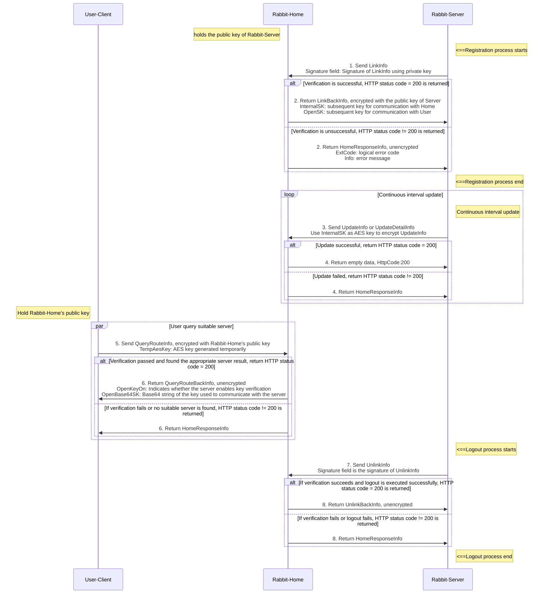

# Rabbit-Home

English | [简体中文](./README.md)

## 1. Introduction

Rabbit-Home is a project for managing and monitoring server instances. It supports managing server instances through command lines and HTTP requests, including connecting, disconnecting, updating status, querying information, and kicking instances.

## 2. Project Structure

```
core/ // The core part of the Rabbit-Home project, including the client, command line, configuration management and server-related logic.
├── client/ // Contains client-related logic for connecting, disconnecting, and updating the status of the server instance.
├── cmd/ // Contains command line related logic, used to manage server instances through the command line.
├── conf/ // Contains configuration-related logic, used to parse and manage parameters in the configuration file.
├── home/ // Contains server-related logic, used to start the server, handle HTTP requests and manage server instances.
└── core.go // core package open interface and structure definition
res/
└── keys/ // Key file used when main and main_test are running
└── keys_example/ // Pre-generated key files and documentation
└── config.yaml // Configuration file used to configure the server's listening address, internal and external IP control, timeout parameters, and logging parameters.
src/
├── main.go // The entry file of the project, starts the server and starts command line listening.
└── main_test.go // Test case, used to test the connection function.
LICENSE // License agreement file
README.md // Chinese project introduction file
README_EN.md // English project introduction file
REMARK.md // Memorandum document
```

- **core** : The core package includes the client, command line, configuration management, and server-related logic.
  - **client** : Client-related logic, such as connecting, disconnecting, and updating status.
  - **cmd** : Command line related logic, such as list, information query and instance kicking, etc.
  - **conf** : Configuration related logic, such as IP validator and configuration parsing, etc.
  - **home** : Server-related logic, such as server startup, processing requests, and managing entities.
  - **core.go** : core package open interface and structure definition
- **res** : Contains configuration files for configuring the server's listening addresses, internal and external IP control, timeout parameters, and logging parameters.
  - **config.yaml** : Configuration file used to configure the server's listening address, internal and external IP control, timeout parameters, and logging parameters.
- **src** : Contains the entry file of the project, starts the server and starts command line listening.
  - **main.go** : The entry file of the project, which starts the server and starts command line listening.
  - **main_test.go** : Test case, used to test the connection function.

## 3. Installation and operation

Use Rabbit-Home in your project by `go mod`or cloning the entire repository into .`gopath`

### Install

Support using go.mod or gopath to manage repositories

- Loading repositories via gopath

```
go get -u github.com/xuzhuoxi/Rabbit-Home
```

- Load the repository through go.mod and  clone the project to the local and install dependencies

```
git clone github.com/xuzhuoxi/Rabbit-Home 
cd Rabbit-Home
go mod tidy
```

### Run the project

```
go run src/main.go
```

## 4. Summary

### Function

- Rabbit-Server registers its own information with Rabbit-Home.
- Rabbit-Server updates its own information status to Rabbit-Home.
- Rabbit-Server unregisters itself with Rabbit-Home.
- The client queries Rabbit-Home for information about the appropriate Rabbit-Server server instance.
- The above functions all support key authentication.

### Function Diagram



## 5. Configuration

The configuration file `res/config.yaml`is used to configure the server's listening address, internal and external IP control, timeout parameters, and logging parameters.

### HTTP Service Configuration

```
http:
  addr: "127.0.0.1:9000"
```

- addr: The listening address and port of the server.
  - Value: 127.0.0.1:9000
  - Description: The server will listen for HTTP requests on port 9000 at the local address 127.0.0.1

### Internal Rabbit-Server instance service configuration

```
internal:
  ##### Internal Rabbit-Server instance Http request method
  post : false
  ##### Internal Rabbit-Server instance timeout settings
  timeout : 300000000000 # 5 minutes, unit: nanoseconds
  ##### Internal Rabbit-Server instance IP access control configuration
  ip-verify:
    allows-on: false
    allows:
    blocks-on: false
    blocks:
      - "192.168.0.1"
      - "10.0.0.1-20"
      - "2001:0db8:85a3:0000:0000:8a2e:0370:7334"
      - "2001:db8:85a3::8a2e:370:7334"
      - "2001:0db8:85a3:0000:0000:8a2e:0370:0-7334"
      - "2001:0db8:85a3:0000:0000:8a2e:0370:0-7334"
  #### Internal Rabbit-Server instance key verification configuration
  key-verify:
    enable : true # Whether to enable key verification
    share : '0000000000000000000000000000000000'  # shared key
    key-type : "pem"  # Key type: pem,rsa,ssh
    keys-path : "keys/public"  # Public key file directory
    hot-keys-enable : true # Whether to enable hot deployment of keys
    hot-keys-path : "keys/hot"  # Public key file path for hot deployment
```

- **post**
  - Value: true|false
  - Description: Whether to use POST request.
- **timeout** : The timeout period of the instance.
  - Value: nanoseconds (ie 5 minutes)
  - Note: If the instance does not send information updates to the server within the timeout period, the instance is considered disconnected.
- ip-verify
  - **allows-on** : Whether to enable internal IP whitelist.
    - Value: false|true
    - Description: When true, the allows configuration takes effect.
  - **allows** : Internal IP whitelist.
    - Value: array, the content is ip address or i address range (only the last group supports '-' to indicate the range), excluding interfaces
    - Note: When allows-on is false, the IP addresses in the whitelist will not take effect.
  - **blocks-on** : Whether to enable internal IP blacklist.
    - Value: false|true
    - Description: When true, the blocks configuration takes effect.
  - **blocks** : Internal IP blacklist.
    - Value: array, the content is ip address or i address range (only the last group supports '-' to indicate the range), excluding interfaces
    - Note: When blocks-on is false, the IP addresses in the blacklist will not take effect.
  - **Notice:**
    - Priority: Blacklist > Whitelist
- key-verify:
  - **enable** : whether to enable key verification
    - Value: true|false
    - Description: Whether to enable key verification
  - **share**: 
    - Value: string
    - Description: Shared key string, used to derive temporary keys, should not be less than 6 characters
  - **key-type** : Key type specification
    - Value: "pem"|"rsa"|"ssh"
    - illustrate:
      - pem: The public key is in x.509 format and the private key is in PKCS#8 format.
      - rsa: The public key is in RSA format and the private key is in PKCS#1 format.
      - ssh: The public key is OpenSSH standard, and the private key is PKCS#1 standard.
  - **keys-path** 
    - Value: string
    - Description: Public key file directory, relative path to the running directory
  - **hot-keys-enable**
    - Value: true/false
    - Description: Whether to enable hot deployment support for keys
  - **hot-keys-path**
    - Value: string
    - Description: The path of the public key file directory for hot deployment, relative to the running directory

### Extranet client service configuration

```
external:
  ##### External client Http request method
  post : false
  ##### External client IP access control configuration
  ip-verify:
    allows-on: false
    allows: []
    blocks-on: false
    blocks:
      - "8.8.8.8"
  key-verify:
    enable : true # Whether to enable key verification
    key-type : "pem"  # Key type: pem,rsa,ssh
    key-path : "keys/private/pkcs8_private.pem"  # Private key file path
```

- **post** : Whether to require a POST request.
- **ip-verify**
  - **allows-on** : Whether to enable external IP whitelisting.
    - Value: false|true
    - Description: When true, the allows configuration takes effect.
  - **allows** : External IP whitelist.
    - Value: array, the content is ip address or i address range (only the last group supports '-' to indicate the range), excluding interfaces
    - Note: When allows-on is false, the IP addresses in the whitelist will not take effect.
  - **blocks-on** : Whether to enable external IP blacklisting.
    - Value: false|true
    - Description: When true, the blocks configuration takes effect.
  - **blocks** : Internal IP blacklist.
    - Value: array, the content is ip address or i address range (only the last group supports '-' to indicate the range), excluding interfaces
    - Note: When blocks-on is false, the IP addresses in the blacklist will not take effect.
  - **Notice:**
    - Priority: Blacklist > Whitelist
- key-verify:
  - **enable**
    - Value: true|false
    - Description: Whether to enable key verification
  - **key-type** : Key type specification
    - Value: "pem"|"rsa"|"ssh"
    - illustrate:
      - pem: The public key is in x.509 format and the private key is in PKCS#8 format.
      - rsa: The public key is in RSA format and the private key is in PKCS#1 format.
      - ssh: The public key is OpenSSH standard, and the private key is PKCS#1 standard.
  - **key-path**
    - Value: string
    - Description: Private key file path, relative to the running directory

### Logging Configuration

```
log:
  type: 0   # 0:Console 1:RollingFile 2:DailyFile 3:DailyRollingFile
  level: 2  # 0:All 1:Trace 2:Debug 3:Info 4:Warn 5:Error 6:Fatal 7:Off
  path: "RabbitHome.log"
  size: '1MB' # 1MB
```

- type: Log record type.
  - value:
    - 支持 0:Console 1:RollingFile 2:DailyFile 3:DailyRollingFile
  - illustrate:
    - Console: 
      - Output to the console.
      - The path and size configurations are ignored.
    - RollingFile: 
      - Rolling file records, the file name is named with a serial number.
      - When the file size reaches the size configuration value, a new file is created and logging continues.
      - The file saving path is: the directory in path, and the latest log file name is the file name in path.
      - File name format:
        - The latest file name: (file name).log, the file name is the configuration file name in path.
        - Historical file name: (file name)_(serial number).log, the file name is the configuration file name in path, and the serial number starts from 0.
    - DailyFile:
      - Daily file records, with file names associated with the date.
      - The size configuration is ignored.
      - The file save path is: the directory in path.
      - The file name format is: (file name)_(yyyyMMdd).log, the file name is the configuration file name in path, and yyyyMMdd is the date.
    - DailyRollingFile:
       
      - Daily rolling file records, the file name is named after the date, and the file name format is: file name *yyyyMMdd* sequence number.log.
      - When the file size reaches the size configuration value, a new file is created and logging continues.
      - The file saving path is: the directory in path, and the latest log file name is the file name in path.
      - File name format:
        - The latest file name: (file name)_(yyyyMMdd).log, the file name is the configuration file name in the path, and yyyyMMdd is the date.
        - Historical file name: (file name) *(yyyyMMdd)* (serial number).log, the file name is the configuration file name in path, yyyyMMdd is the date, and the serial number starts from 0.
- path: log file path.
  - value:
    - The path where the log file is saved. Both relative and absolute paths are supported.
  - illustrate:
    - Ignored in Console mode.
    - The file name information participates in the file name naming of the RollingFile and DailyRollingFile modes.
- level: Log level.
  - value:
    - Support 0:All 1:Trace 2:Debug 3:Info 4:Warn 5:Error 6:Fatal 7:Off
  - Note: Only log information with level >= value is recorded.
- size: log file size.
  - Format: value[unit]
  - illustrate:
    - Numeric value: supports decimals
    - Unit: Supports KB, MB, GB, TB, PB, EB. If not written, it is represented as Byte, but Byte **cannot be written .**
    - This parameter is effective in RollingFile and DailyRollingFile modes, indicating the upper limit of the rolling file size.

## 6. API Description

### 6.1 RegisteredEntity

The instance information recorded by Rabbit-Home is RegisteredEntity

```
// RegisteredEntity registered instance
type  RegisteredEntity  struct {
    core . LinkInfo                        // Information sent by Rabbit-Server
    State          core . UpdateInfo        // Simple instance status
    Detail         core . UpdateDetailInfo  // Instance detailed status
    
    internalSK        [] byte  //Internal temporary symmetric key
    internalBase64SK  string  //Internal temporary symmetric key base64 string
    openSK            [] byte  // External temporary symmetric key
    openBase64SK      string  // Base64 string of temporary symmetric key for external use
    lastUpdateNano    int64   // Last update timestamp
    hit               int     // hit count
}

// LinkInfo
// Information required to connect to Rabbit-Home
type LinkInfo struct {
    Id           string  `json:"id"`            // Instance Id (unique)
    PlatformId   string  `json:"pid"`           // Platform Id
    TypeName     string  `json:"type-name"`     // instance type name (not unique)
    OpenNetwork  string  `json:"open-network"`  // Open connection communication protocol
    OpenAddr     string  `json:"open-addr"`     // Open connection address
    OpenKeyOn    bool    `json:"open-key-on"`   // Whether to enable key authentication for the client
    Signature    string  `json:"signature"`     // signature
}

// LinkBackInfo
// Connection result information, returned from Rabbit-Home, encrypted by RSA
type LinkBackInfo struct {
    Id          string  `json:"id"`           // Instance ID (unique), plain text
    InternalSK [] byte  `json:"internal-sk"`  // Temporary RSA key, used for internal encryption
    OpenSK      [] byte  `json:"open-sk"`      // Temporary RSA key, used for external encryption
    Extend      string  `json:"extend"`       // extended information, plain text
}

// UpdateInfo instance status
type UpdateInfo struct {
    Id      string   `json:"id"`      // Instance Id
    Weight  float64  `json:"weight"`  // pressure coefficient
}

// UpdateDetailInfo instance detailed status
type UpdateDetailInfo struct {
    Id              string  `json:"id"`            // Instance Id
    StartTimestamp  int64   `json:"start"`         // start timestamp (nanoseconds)
    StatsInterval   int64   `json:"sta-interval"`  // Statistics interval
    
    MaxLinks       uint64  `json:"max-links"`   // Maximum number of links
    TotalReqCount  int64   `json:"total-reg"`   // Total number of requests
    TotalRespTime  int64   `json:"total-resp"`  // Total response time
    MaxRespTime    int64   `json:"max-resp"`    // Maximum response time (nanoseconds)
    Links          uint64  `json:"links"`       // Number of links
    
    StatsTimestamp     int64  `json:"sta-start"`  // Statistics start timestamp (nanoseconds)
    StatsReqCount      int64  `json:"sta-req"`    // Statistical request count
    StatsRespUnixNano  int64  `json:"sta-resp"`   // Statistics response time (nano)
    
    EnableKeys  string  `json:"enable-keys"`  // attribute enable flag
}

// QueryRouteInfo
// Find a suitable Rabbit-Server instance
type QueryRouteInfo struct {
    PlatformId  string  `json:"pid"`        // Service platform ID
    TypeName    string  `json:"type-name"`  // type name
    TempAesKey [] byte  `json:"temp-key"`   // Temporary AES key, used to encrypt the data returned by Rabbit-Home. If not provided, the returned key data will be returned as a Base64 string
}

// QueryRouteBackInfo search results
// Find the appropriate Rabbit-Server instance and return information from Rabbit-Home
type QueryRouteBackInfo struct {
    Id            string  `json:"id"`            // Instance Id (unique)
    PlatformId    string  `json:"pid"`           // Service platform ID
    TypeName      string  `json:"type-name"`     // instance type name (not unique)
    OpenNetwork   string  `json:"open-network"`  // Open connection communication protocol
    OpenAddr      string  `json:"open-addr"`     // Open connection address
    OpenKeyOn     bool    `json:"open-key-on"`   // Whether to enable key authentication for the client
    OpenBase64SK  string  `json:"open-sk"`       // Base64 string representation of the temporary key, used for symmetrically encrypted data. If a temporary key is set during the request, it will be encrypted.
    OpenSK        [] byte  // Temporary key, updated after executing ComputeOpenSK, used for symmetric encryption data
}

```

- RegisteredEntity: A registered instance.
  - core.LinkInfo: information sent by Rabbit-Server
  - State: simple state of the instance
  - Detail: Instance detailed status
  - internalSK: internal temporary symmetric key
  - internalBase64SK: internal temporary symmetric key base64 string
  - openSK: temporary symmetric key for external use
  - openBase64SK: temporary symmetric key base64 string for external use
  - lastUpdateNano: last update timestamp
  - hit: number of hits
- LinkInfo: Instance connection information.
  - Id: Instance ID (unique)
  - PlatformId: Platform Id
  - TypeName: Instance type name (not unique)
  - OpenNetwork: Connection Type
  - OpenAddr: Connection address
  - OpenKeyOn: Whether to enable key authentication for the client
  - Signature:
- LinkBackInfo: Connection result information.
  - Id: Instance ID (unique), plain text
  - InternalSK: Temporary RSA key, used for internal encryption
  - OpenSK: Temporary RSA keys, used for external encryption
- UpdateInfo: Instance simple status.
  - Id: Instance ID
  - Weight: Pressure coefficient.
- UpdateDetailInfo: Instance detailed status.
  - Id: Instance ID
  - StartTimestamp: start timestamp (nanoseconds)
  - StatsInterval: Statistics interval
  - MaxLinks: Maximum number of connections
  - TotalReqCount: total number of requests
  - TotalRespTime: Total response time
  - MaxRespTime: Maximum response time (nanoseconds)
  - Links: Number of connections
  - StatsTimestamp: Statistics start timestamp (nanoseconds)
  - StatsReqCount: Statistics request count
  - StatsRespUnixNano: Statistics response time (nanoseconds)
  - EnableKeys: Property enable flags
- QueryRouteInfo: Find a suitable Rabbit-Server instance.
  - PlatformId: Service platform ID
  - TypeName: instance type name
  - TempAesKey: Temporary AES key, used to encrypt the data returned by Rabbit-Home. If not provided, the returned key data will be returned as a Base64 string.
- QueryRouteBackInfo: Find the results.
  - Id: Instance ID (unique)
  - PlatformId: Service platform ID
  - TypeName: Instance type name (not unique)
  - OpenNetwork: Connection Type
  - OpenAddr: Connection address
  - OpenKeyOn: Whether to enable key authentication for the client
  - OpenBase64SK: Base64 string representation of a temporary key, used to symmetric encrypt data. If a temporary key is set during the request, it is encrypted.
  - OpenSK: Temporary key, updated after ComputeOpenSK is executed, used for symmetric encryption of data

### 6.2 Server-related API interfaces

The instance can communicate with Rabbit-Home through the API under the core/client/ package. 
 In the following, {homeAddrUrl} represents the address associated with http.addr configured in config.yaml.

- Server connects to Rabbit-Home: "d" in the url parameter is required, "w" is optional
  - `LinkWithGet(homeAddrUrl string, info core.LinkInfo, weight float64, cb httpx.ReqCallBack) error`
    - homeAddrUrl: Rabbit-Home server address, does not need to contain Pattern, the actual Pattern is home.PatternLink, i.e. "/link"
    - info: basic information of the game server instance
    - weight: The instance pressure coefficient is heavy. The larger the value, the higher the server pressure.
    - cb: callback, passing nil means no processing
    - Return value: If an error occurs during the call, the error message is returned.
  - `LinkWithPost(homeAddrUrl string, info core.LinkInfo, weight float64, cb httpx.ReqCallBack) error`
    - homeAddrUrl: Rabbit-Home server address, does not need to contain Pattern, the actual Pattern is home.PatternLink, i.e. "/link"
    - info: basic information of the game server instance
    - weight: The instance pressure coefficient is heavy. The larger the value, the higher the server pressure.
    - cb: callback, passing nil means no processing
    - Return value: If an error occurs during the call, the error message is returned.
- Server disconnects Rabbit-Home: "d" in url parameter is necessary
  - `UnlinkWithGet(homeAddrUrl string, info UnlinkInfo, cb httpx.ReqCallBack) error`
    - homeAddrUrl: Rabbit-Home server address, does not need to contain Pattern, the actual Pattern is home.PatternUnlink, i.e. "/unlink"
    - info: Basic information required to disconnect from the server instance
    - cb: callback, passing nil means no processing
    - Return value: If an error occurs during the call, the error message is returned.
  - `UnlinkWithPost(homeAddrUrl string, info UnlinkInfo, cb httpx.ReqCallBack) error`
    - homeAddrUrl: Rabbit-Home server address, does not need to contain Pattern, the actual Pattern is home.PatternUnlink, i.e. "/unlink"
    - id: Basic information required to disconnect the server instance
    - cb: callback, passing nil means no processing
    - Return value: If an error occurs during the call, the error message is returned.
- Server updates information to Rabbit-Home: "id" and "d" are required in the url parameter, and "dt" is required for detailed updates
  - `UpdateWithGet(homeAddrUrl string, info core.UpdateInfo, cb httpx.ReqCallBack) error`
    - homeAddrUrl: Rabbit-Home server address, does not need to contain Pattern, the actual Pattern is home.PatternUpdate, that is, "/update"
    - info: Server instance update information
    - cb: callback, passing nil means no processing
    - Return value: If an error occurs during the call, the error message is returned.
  - `UpdateWithPost(homeAddrUrl string, info core.UpdateInfo, cb httpx.ReqCallBack) error`
    - homeAddrUrl: Rabbit-Home server address, does not need to contain Pattern, the actual Pattern is home.PatternUpdate, that is, "/update"
    - info: Server instance update information
    - cb: callback, passing nil means no processing
    - Return value: If an error occurs during the call, the error message is returned.
  - `UpdateDetailWithGet(homeAddrUrl string, detail core.UpdateDetailInfo, cb httpx.ReqCallBack) error`
    - homeAddrUrl: Rabbit-Home server address, does not need to contain Pattern, the actual Pattern is home.PatternUpdateDetail, i.e. "/update"
    - detail: server instance detailed update information
    - cb: callback, passing nil means no processing
    - Return value: If an error occurs during the call, the error message is returned.
  - `UpdateDetailWithPost(homeAddrUrl string, detail core.UpdateDetailInfo, cb httpx.ReqCallBack) error`
    - homeAddrUrl: Rabbit-Home server address, does not need to contain Pattern, the actual Pattern is home.PatternUpdateDetail, i.e. "/update"
    - detail: server instance detailed update information
    - cb: callback, passing nil means no processing
    - Return value: If an error occurs during the call, the error message is returned.

### 6.3 Client-related API interfaces

The instance can communicate with Rabbit-Home through the API under the core/client/ package to obtain the server instance information that should be connected. 
 In the following, {homeAddrUrl} represents the address associated with http.addr configured in config.yaml.

- The client requests the server instance: the "d" in the url parameter is necessary,
  - `RouteWithGet(homeAddrUrl string, cb httpx.ReqCallBack) error`
    - homeAddrUrl: Rabbit-Home server address, does not need to contain Pattern, the actual Pattern is home.PatternRoute, that is, "/route"
    - cb: callback, contains server instance information
    - Return value: If an error occurs during the call, the error message is returned.
  - `RouteWithPost(homeAddrUrl string, cb httpx.ReqCallBack) error`
    - homeAddrUrl: Rabbit-Home server address, does not need to contain Pattern, the actual Pattern is home.PatternRoute, that is, "/route"
    - cb: callback, contains server instance information
    - Return value: If an error occurs during the call, the error message is returned.

## 7. Command line usage

After starting the project, you can perform the following operations through the command line:

- List instances
  - Example:`list -name=Name -on=[true|false] -pid=PID`
  - -name: Instance name.
  - -on: Whether the instance is online.
  - -pid: instance platform ID.
  - If the above parameters are not specified, all matching instances will be listed.
- Query instance information
  - Example:`info -id=Id`
  - -id: Instance ID.
  - The id parameter is required.
- Kick instance
  - Example:`kick -id=Id`
  - -id: Instance ID.
  - The id parameter is required.
  - **Functionality not implemented** .

## 8. Dependencies

- infra-go https://github.com/xuzhuoxi/infra-go
   basic library support library.
- goxc https://github.com/laher/goxc
   package dependency library, mainly used for cross-compilation
- json-iterator https://github.com/json-iterator/go
   Json interpretation library with corresponding structure
- yaml.v2 https://gopkg.in/yaml.v2
   YAML configuration parsing library

## 9. Contact

xuzhuoxi
 [xuzhuoxi@gmail.com](mailto:xuzhuoxi@gmail.com) or [mailxuzhuoxi@163.com](mailto:mailxuzhuoxi@163.com) or [m_xuzhuoxi@outlook.com](mailto:m_xuzhuoxi@outlook.com)

## 10. License

Rabbit-Home source code is available under the MIT [License]().
